# Bank Customers Classification
This project developes a classification system to predict who should be given credit in the future. By using many classification methods which method works best as follows.
- Decision tree
- Random forest
- Adaboost
- GradientBoost
- XGBoost
- Support Vector Machine
- Feedforward neural network 

## Preprocessing Process
Given this dataset, I must preprocess the data by converting the features from nominal to numerical data. Checks whether the data contains NaN, missing values or not. Then splitting the data-set into training and test set into 73:27 in order.

Last preprocessing steps, I had tried 3 solutions for feature scaling
1) [Choose all features](#Choose-all-features)
2) [Feature Selection using Filter Method](#Feature-Selection-using-Filter-Method)
3) [Feature Selection using Embedded Method](#Feature-Selection-using-Embedded-Method)

#### Choose all features
These are result that I got from using all features to predict who should be given credit in the future.

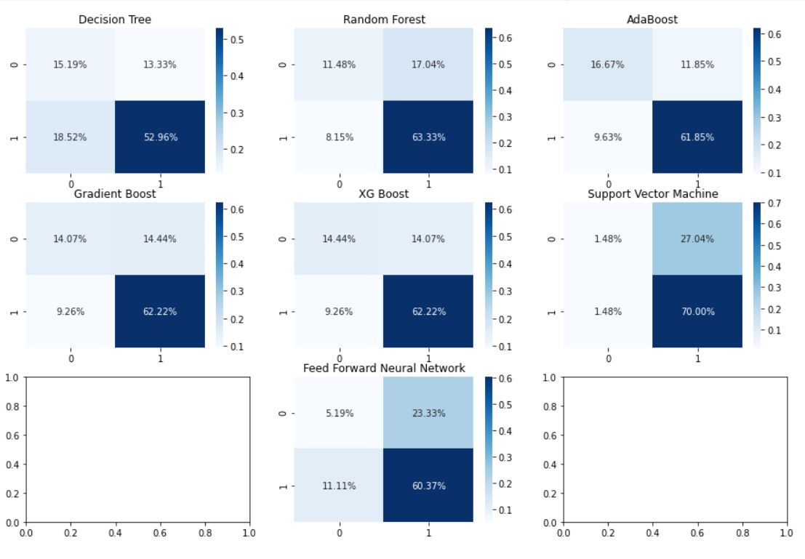
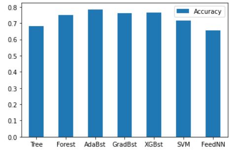

As we can see that, XG Boost, Gradient Boost, and Ada Boost have the best 3 ranking of accuracy. If I need to choose one method from my works, I must choose Ada Boost because from inspecting correlation matrix, Ada boost method predicts to give credit on people who shoudn't be given credit for 11.85% which is at least from all three methods.

#### Feature Selection using Filter Method
These are result that I got from using Feature Selection using Filter Method to predict who should be given credit in the future.
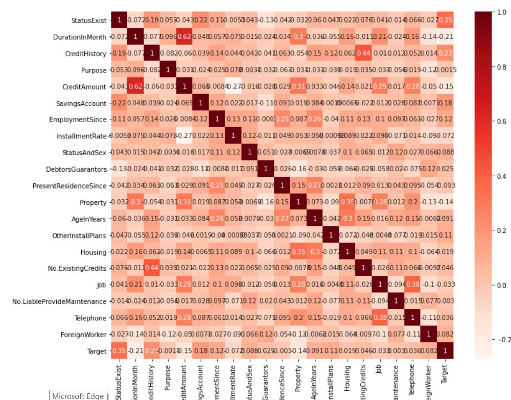
As we can see, I filter and will take only the subset of the relevant features. The filtering here is done using correlation matrix and it is most commonly done using Pearson correlation. Using correlation more than 0.2 will get 3 features such as
- StatusExist
- DurationInMonth    
- CreditHistory

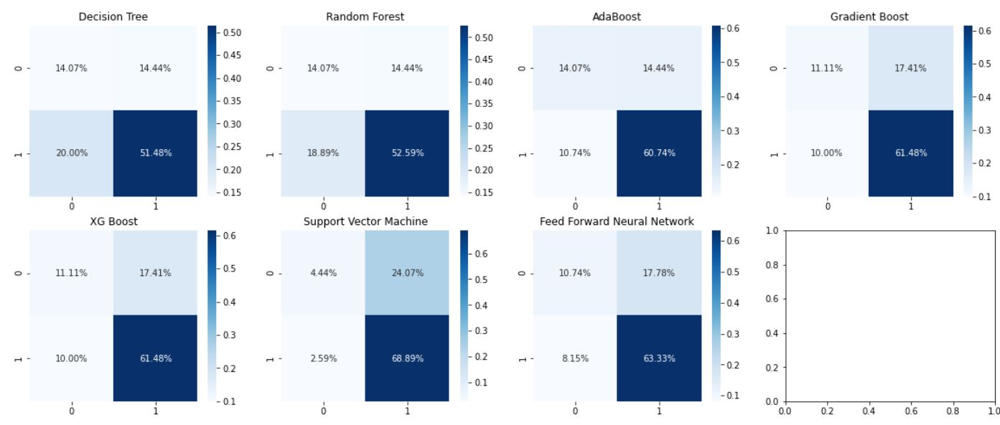
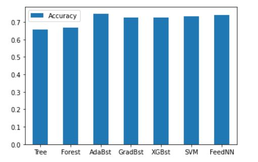

As we can see, all of the methods had be changed the result not that much. Overall of the result is worse than choosing all features that I already done for.

#### Feature Selection using Embedded Method
These are result that I got from using Feature Selection using Filter Method to predict who should be given credit in the future.
I using Embedded methods to takes care of each iteration of the model training process and carefully extract those features which contribute the most to the training for a particular iteration. Regularization methods are the most commonly used embedded methods which penalize a feature given a coefficient threshold.
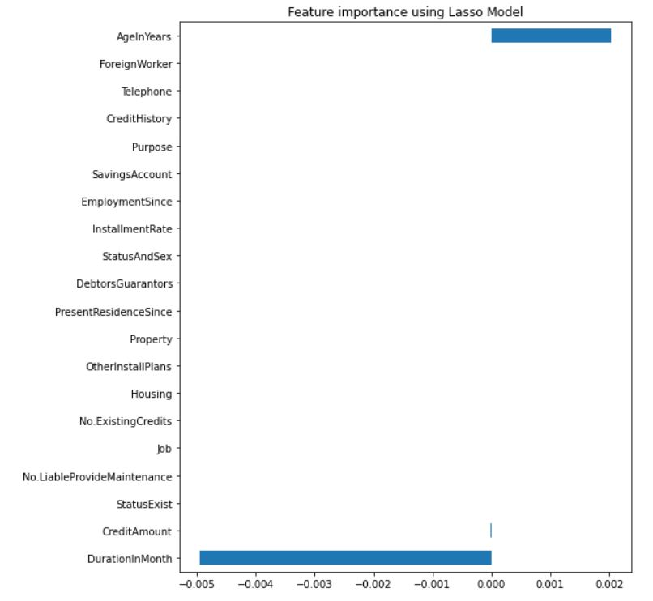
I was done feature selection using Lasso regularization. If the feature is irrelevant, lasso penalizes it’s coefficient and make it 0. Hence the features with coefficient = 0 are removed and the rest are taken. Hence, Lasso model has taken 3 features such as
- AgeInYears
- DurationInMonth
- CreditAmount

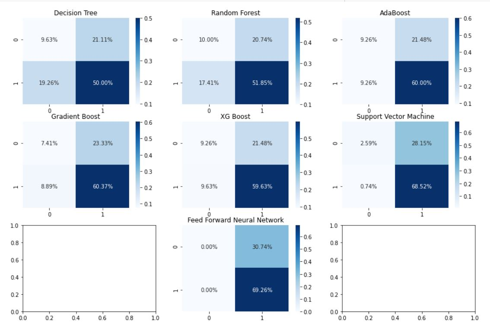
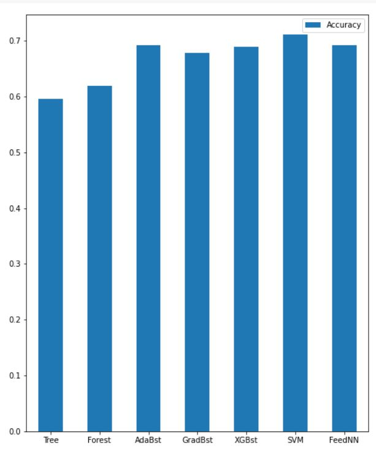

From the results, overall of all methods worse than before except XG Boost. I already search internet that Embedded method will has more accuracy more than Filter method using correlation matrix method also, proper with model which has features around 20 features but, I don't understand why the result outs in this way.
I assume that the data set might be small so, the overall of the result using 3 methods of preprocessing has outcome around 70% no matter how calssification method I used. 

## Conclusion
From all of classification methods, Ada boost gives me the best accuracy and be the best method that I got from the results. Also, give credit on people who shoudn't be given credit for with least percentage from all classification methods.
Also, Feed Forward Neural Network looks fine if we using Filter Method to reduce the features.
Let's talk about precision and recall of this project,
this project gives the result of recall by given credit more than not given credit that means all models have a chance to answer given credit more than not given credit in the result. Hence, the model has inclined to given credit to the customer.
Precision find the result among the wrong prediction then, the result are the same as recall that given credit to customer has more precision value more than not given credit to the customer.

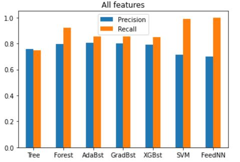
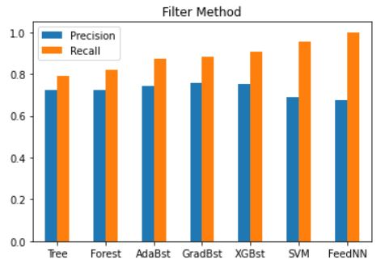
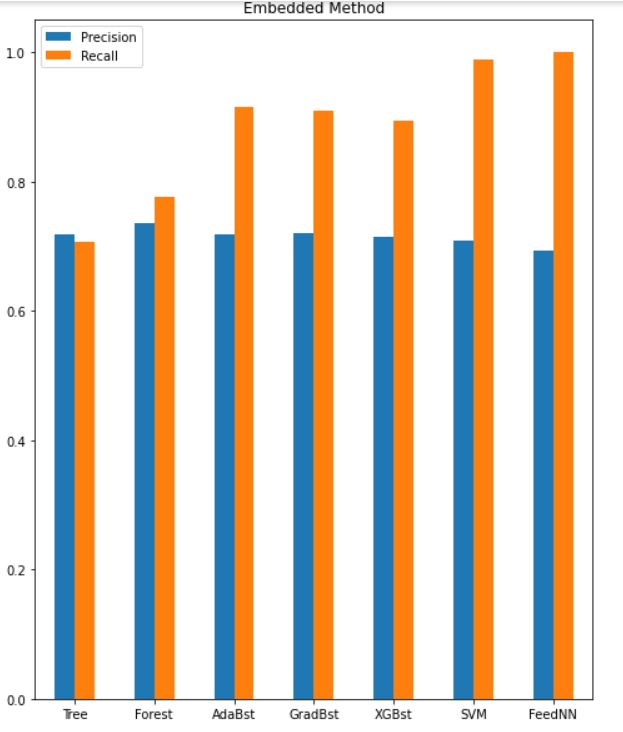

Data Source -> [German Data](https://archive.ics.uci.edu/ml/datasets/statlog+(german+credit+data))

## Developer
Kornphon    Noiprasert  6010545021 

`Note:` This project created a student in Software and Knowledge engineering program, which this application is final project as part of Machine Learning course for second semester of Kasetsart University.